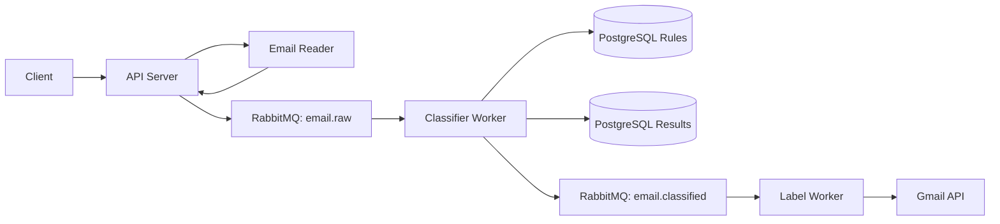

# Email Triage System

Email Triage System is a Go backend project for explainable Gmail triage. It reads email metadata, classifies messages with database-backed rules, stores scan results, and can apply Gmail labels through an asynchronous worker pipeline.

This is a personal backend engineering project, not a production SaaS product. The focus is event-driven architecture, rule precedence, idempotent processing, and privacy-conscious integration with Gmail.

## Why This Exists

Gmail filters are good for stable sender and subject rules. This project explores the layer around those filters:

- dry-run scans before labels are applied;
- explainable classification reasons;
- global and user-specific rule precedence;
- persisted scan history for review and debugging;
- a worker-based pipeline that separates reading, classification, and label application.

For a single personal inbox, Gmail filters may be enough. This repository is best read as a backend case study and experimentation environment.

## Features

- Gmail reader with OAuth token support.
- Mock reader for local development and tests.
- Rule-based classifier with labels:
  - `Job`
  - `Transactions`
  - `Security`
  - `Promo`
  - `Social`
  - `Unknown`
- PostgreSQL-backed User Rules.
- Global Rules and User-Specific Rules.
- Priority and specificity scoring.
- Manual scan endpoint with `dry_run` and `apply` modes.
- RabbitMQ event flow:
  - `email.raw`
  - `email.classified`
- Gmail label worker for apply mode.
- Idempotent storage by `user_id + gmail_message_id`.
- No raw email body persistence.

## Architecture



The API starts scans and publishes raw message events. The classifier worker loads rules, assigns a label, stores the result, and publishes apply events when requested. The label worker applies Gmail labels and archives messages only in `apply` mode.

## Rule Model

Rules are stored in PostgreSQL instead of compiled into the classifier.

Supported fields:

- `sender_email`
- `sender_domain`
- `subject`
- `body`
- `any`

Supported operators:

- `equals`
- `contains`

User-Specific Rules override Global Rules. Within the same scope, higher priority wins, with a small specificity bonus for more precise fields and `equals` matches.

Example:

```sql
INSERT INTO user_rules (user_id, rule_type, operator, rule_value, target_label, enabled, priority)
VALUES
  (NULL, 'sender_domain', 'contains', 'linkedin.com', 'Job', true, 300),
  (NULL, 'subject', 'contains', 'receipt', 'Transactions', true, 250),
  (NULL, 'sender_email', 'equals', 'no-reply@accounts.google.com', 'Security', true, 350);
```

## Privacy Model

- OAuth credentials and Gmail tokens are local files and are ignored by git.
- Email body snippets may be used in memory for classification.
- Raw email body content is not stored.
- Persisted data is limited to metadata, classification output, confidence, status, and reason.
- Attachments are not part of the current pipeline.

## Local Setup

Requirements:

- Go 1.24+
- Docker and Docker Compose
- Gmail API credentials only if using the real Gmail reader

Show available commands:

```bash
make help
```

Start the full local stack:

```bash
make run
```

This starts PostgreSQL, RabbitMQ, migrations, API server, classifier worker, and label worker.

Check health:

```bash
make healthz
```

Trigger a dry-run scan:

```bash
make scan-dry-run
```

The scan request returns after the scan run is accepted. Use the returned `run_id` to inspect enqueue progress:

```bash
curl http://localhost:8080/scans/1
```

The response includes enqueue counters (`total_found`, `total_processed`, `total_failed`), downstream email status counters (`dry_run`, `classified`, `applied`), and a derived `processing_status`.

Override the configured Gmail query for one scan:

```bash
curl -X POST http://localhost:8080/scans \
  -H "Content-Type: application/json" \
  -d '{"mode":"dry_run","query":"-in:trash -in:spam"}'
```

Recurring scans can be enabled inside the API process:

```text
SCHEDULED_SCAN_INTERVAL=3h
SCHEDULED_SCAN_MODE=apply
SCHEDULED_SCAN_QUERY=in:inbox -in:trash newer_than:1d
```

Stop the stack:

```bash
make stop
```

## Gmail Setup

The mock reader is the default. To use Gmail:

1. Enable the Gmail API in Google Cloud.
2. Create an OAuth Client ID for a desktop app.
3. Save the downloaded credentials as:

   ```text
   secrets/gmail_credentials.json
   ```

4. Run the OAuth flow:

   ```bash
   make gmail-auth
   ```

5. The token is saved to:

   ```text
   secrets/gmail_token.json
   ```

6. Start the API with Gmail as the source:

   ```bash
   EMAIL_SOURCE=gmail \
   GMAIL_CREDENTIALS_FILE=secrets/gmail_credentials.json \
   GMAIL_TOKEN_FILE=secrets/gmail_token.json \
   GMAIL_READ_MAX_RESULTS=100 \
   GMAIL_READ_QUERY='in:inbox -in:trash' \
   go run ./cmd/api-server
   ```

## Configuration

See `.env.example` for supported environment variables.

Important defaults:

- `EMAIL_SOURCE=mock`
- `HTTP_PORT=8080`
- `GMAIL_READ_QUERY=in:inbox -in:trash`
- `GMAIL_READ_MAX_RESULTS=100`
- `LABEL_WORKER_CONCURRENCY=4`

## Tests

```bash
go test ./...
```

Unit tests do not require Gmail, PostgreSQL, or RabbitMQ.

## Limitations

- Classification is rule-based only; there is no LLM or ML classifier.
- The current label set is experimental.
- `Unknown` is the fallback label when no rule matches.
- `Transactions` may overlap with Gmail's built-in purchase/order categorization.
- There is no UI or authentication layer.
- Kubernetes manifests are intentionally not included in this public repository.

## Documentation

- [Architecture](docs/architecture.md)
- [ADR 0001: Database-managed Global Rules](docs/adr/0001-database-managed-global-rules.md)
- [Publication Hygiene Plan](docs/publication-hygiene-plan.md)
