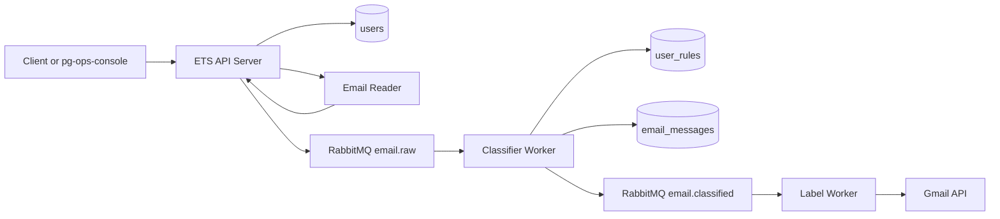

# Email Triage System Architecture

This document is the current map of the Email Triage System codebase. It is written for maintainers and agents that need to understand the repository before making changes.

## Product Scope

Email Triage System is a backend service for explainable Gmail triage. It reads messages from a configured source, classifies them with database-managed rules, stores scan results, and can apply Gmail labels asynchronously.

The current scope is a single-owner deployment model with project-owned authentication:

- ETS owns Users, Telegram identity mapping, roles, and JWT issuing.
- `pg-ops-console` can consume ETS-issued JWTs as a reusable admin console.
- ETS does not contain a first-party web UI.

## Runtime Components

- API server: `cmd/api-server`
- Classifier worker: `cmd/classifier-worker`
- Label worker: `cmd/label-worker`
- Gmail OAuth helper: `cmd/gmail-auth`
- PostgreSQL: durable storage and rule source of truth
- RabbitMQ: event transport between API and workers
- Gmail API: optional real email reader and label applier

## Authentication And Authorization

Auth code lives under `internal/auth` and `internal/api/auth.go`.

Public endpoints:

- `GET /healthz`
- `POST /auth/telegram`

Authenticated endpoints:

- `GET /auth/me`
- `POST /scans`
- `GET /scans/{id}`

Telegram login flow:

1. Client sends Telegram Login Widget payload to `POST /auth/telegram`.
2. ETS verifies the Telegram hash with `TELEGRAM_BOT_TOKEN`.
3. ETS looks up `users.telegram_id`.
4. Disabled or unknown users are rejected.
5. ETS issues an HS256 JWT.

JWT claims include:

- `iss`: configured `JWT_ISSUER`
- `aud`: configured `JWT_AUDIENCE`
- `sub`: ETS `users.id`
- `role`: `user` or `admin`
- `provider`: `telegram`
- `exp`: configured by `AUTH_TOKEN_TTL`

Authorization rules currently implemented:

- `POST /scans`: any authenticated `user` or `admin`; `user_id` always comes from the JWT subject.
- `GET /scans/{id}`: `admin` can read any scan; `user` can read only owned scans.

Users are pre-provisioned in the database. There is no public self-registration path.

## Data Model

Schema migrations live in `migrations/`.

Primary tables:

- `users`
  - UUID identity, Telegram identity, display metadata, role, enabled flag.
- `scan_runs`
  - One scan request and enqueue progress for one user.
- `email_messages`
  - Idempotent classification result keyed by `(user_id, gmail_message_id)`.
- `user_rules`
  - Global and user-specific classification rules.

`user_rules.user_id = NULL` means Global Rule. A non-null `user_id` means User-Specific Rule.

The initial migration reflects the current MVP schema directly. Later migrations remain to document the historical path for existing local deployments.

## Scan Flow

1. Authenticated client calls `POST /scans`.
2. API creates a `scan_runs` row with `status=enqueuing`.
3. API reads messages from the configured reader:
   - mock reader by default;
   - Gmail reader when `EMAIL_SOURCE=gmail`.
4. API publishes one `email.raw` event per message.
5. API updates scan enqueue counters and completes the run as `queued` or `queued_with_errors`.
6. Classifier worker consumes `email.raw`.
7. Classifier worker loads applicable rules, classifies the message, and upserts `email_messages`.
8. In `apply` mode, classifier worker publishes `email.classified`.
9. Label worker consumes `email.classified`, applies Gmail labels, optionally marks messages read, and updates status.

`GET /scans/{id}` returns enqueue counters plus derived downstream status counts from `email_messages`.

## Rule Engine

Rule code lives under `internal/rules` and `internal/classifier`.

Supported rule fields:

- `sender_email`
- `sender_domain`
- `subject`
- `body`
- `any`

Supported operators:

- `equals`
- `contains`

Selection order:

1. Evaluate enabled User-Specific Rules for the current user.
2. If any match, choose the best user-specific match by priority and specificity.
3. Otherwise evaluate Global Rules.
4. Choose the best global match by priority and specificity.
5. Fall back to `Unknown`.

Classification stores a short reason for auditability. Body snippets may be used in memory, but raw email body content is not persisted.

## Privacy And Secret Boundaries

Persisted data is limited to metadata, rule matches, classification output, confidence, status, and timestamps.

The repository must not contain runtime secrets:

- `.env`
- `secrets/`
- Gmail OAuth credentials and tokens
- Telegram bot tokens
- production database or broker credentials

The local `.gitignore` excludes those paths. `JWT_SECRET` and `TELEGRAM_BOT_TOKEN` are runtime configuration, not repository content.

## Configuration

Core environment:

- `HTTP_PORT`
- `POSTGRES_URL`
- `RABBITMQ_URL`
- `EMAIL_SOURCE`
- `GMAIL_CREDENTIALS_FILE`
- `GMAIL_TOKEN_FILE`
- `GMAIL_READ_MAX_RESULTS`
- `GMAIL_READ_QUERY`
- `LABEL_WORKER_CONCURRENCY`

Auth environment:

- `JWT_SECRET`
- `JWT_ISSUER`
- `JWT_AUDIENCE`
- `TELEGRAM_BOT_TOKEN`
- `AUTH_TOKEN_TTL`

Scheduled scan environment:

- `SCHEDULED_SCAN_INTERVAL`
- `SCHEDULED_SCAN_USER_ID`
- `SCHEDULED_SCAN_MODE`
- `SCHEDULED_SCAN_QUERY`
- `SCHEDULED_SCAN_MARK_READ`

See `.env.example` and `README.md` for local usage.

## Package Map

- `internal/api`: HTTP routing, auth endpoints, scan endpoints.
- `internal/auth`: Telegram verification, JWT issue/verify, principal middleware.
- `internal/broker`: RabbitMQ publishing and event payloads.
- `internal/classifier`: deterministic rule-based classification.
- `internal/config`: environment loading.
- `internal/consumer`: classifier and label worker loops.
- `internal/gmail`: Gmail OAuth, read, and label operations.
- `internal/reader`: mock/Gmail reader abstraction.
- `internal/rules`: rule model and matching concepts.
- `internal/storage`: PostgreSQL persistence and row models.

## External Console Integration

`pg-ops-console` is intentionally separate. ETS issues JWTs and owns user semantics; POS validates those JWTs and applies only coarse console policy. POS should not create ETS users or define ETS role meaning.

For local or deployed console login, POS can send a Telegram Login Widget payload to ETS `POST /auth/telegram`, store the returned project token in a session cookie, and use it as `Authorization: Bearer`.

ETS scan operations can be exposed in POS as Project Extension Actions without
adding ETS-specific UI or manifest endpoints. In the initial integration, POS
configuration can describe a generic action that calls the existing
`POST /scans` endpoint server-side with the ETS-issued JWT. ETS remains the
authority for scan authorization and derives the scan owner from the JWT subject.
POS can link action results back to database explorer views such as `scan_runs`
and `email_messages`.

## Current Limitations

- No first-party web UI in this repository.
- No self-registration; users are database-provisioned.
- No row-level policy in PostgreSQL; ownership checks are currently in API and console policy.
- Classification is rule-based only; there is no LLM or ML classifier.
- Observability is basic logs and stored counters.
- Kubernetes deployment manifests live outside this repository.

## Change Guidelines

- Keep ETS as the owner of domain users and role semantics.
- Keep POS integration project-JWT based; do not move Telegram bot token or user provisioning into POS.
- Prefer database-managed rules over classifier hard-coding.
- Preserve the privacy boundary: do not persist raw email body content.
- When changing scan behavior, update API flow, worker flow, and status counters together.
